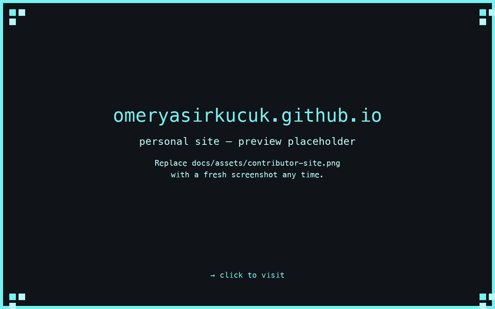

# About the maintainer

## Omer Yasir Kucuk

**Senior Data Engineer at Procter & Gamble**

Data Engineer focused on scalable data pipelines, distributed data processing with Spark,
and reliable data platforms in hybrid environments. Proven track record in improving
runtime efficiency, minimizing storage costs, and ensuring high-quality data.

AMX is the open-source side of that work — a CLI for the long-tail problem of
undocumented database schemas across the data platforms data engineers actually use day
to day.

## Connect

-   [**:material-web: Personal site**](https://omeryasirkucuk.github.io)

    Long-form essays, projects, talks.

-   [**:fontawesome-brands-github: GitHub**](https://github.com/omeryasirkucuk)

    `omeryasirkucuk` — AMX source, side projects, dotfiles.

-   [**:fontawesome-brands-linkedin: LinkedIn**](https://linkedin.com/in/omeryasirkucuk)

    Professional updates, work history, recommendations.

-   [**:fontawesome-brands-medium: Medium**](https://medium.com/@omeryasirkucuk)

    Long-form data-engineering and ML write-ups.

-   [**:fontawesome-brands-kaggle: Kaggle**](https://kaggle.com/omeryasirkucuk)

    Competitive ML notebooks and datasets.

-   [**:material-email: Email**](mailto:omeryasirkucuk@gmail.com)

    `omeryasirkucuk@gmail.com` — for AMX, collaboration, or just to say hi.

## Personal site

[{ .amx-about-screenshot }](https://omeryasirkucuk.github.io)

[Visit the personal site →](https://omeryasirkucuk.github.io)

!!! note "Drop your own screenshot here"
    Replace `docs/assets/contributor-site.png` with a fresh screenshot of
    [omeryasirkucuk.github.io](https://omeryasirkucuk.github.io) any time you refresh
    the personal site. The image link above renders whatever's at that path; until
    a custom screenshot lands there, the page falls back to the link card below.

## What's next

- [GitHub repository](https://github.com/omeryasirkucuk/amx) — file issues, send PRs, watch releases.
- [Contributing](contributing.md) — development setup, commit format, release process.
- [Security](security.md) — how to report vulnerabilities responsibly.
