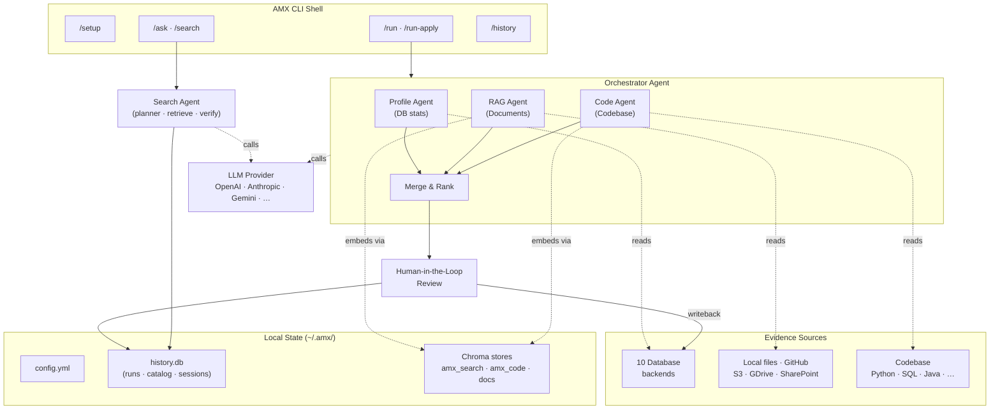
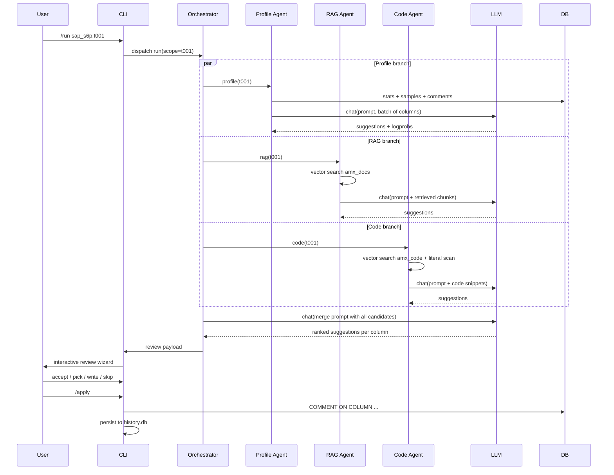

# Architecture

AMX is a CLI shell wrapped around a multi-agent inference engine, a backend-neutral metadata
adapter, and a local SQLite catalog. Every component is replaceable through configuration —
swap LLM providers, change DB backends, plug in different document or code roots — without
re-architecting the pipeline.

## High-level flow

## Components

### CLI shell (`amx.cli` + `amx.cli_support`)

Thin layer over [Click](https://click.palletsprojects.com/) and
[prompt_toolkit](https://python-prompt-toolkit.readthedocs.io/). Provides the slash-command
REPL, namespace switching (`/db`, `/llm`, `/code`, `/docs`, `/search`, `/analyze`,
`/history`, `/session`), tab completion, and the interactive review wizard.

Each namespace is a Click sub-command tree under `amx.cli_support.commands.*`. The CLI is
**not** the public Python API — for programmatic use see [Python API](../api/index.md).

### Multi-agent orchestrator (`amx.agents`)

The orchestrator dispatches three independent sub-agents in parallel and merges their
suggestions:

| Agent | Source | Module | Output |
|---|---|---|---|
| **Profile Agent** | Database | `amx.agents.profile_agent` | Per-column suggestions backed by stats |
| **RAG Agent** | Documents | `amx.agents.rag_agent` | Per-column suggestions backed by doc snippets |
| **Code Agent** | Codebase | `amx.agents.code_agent` | Per-column suggestions backed by code references |

The merge step is itself an LLM call — the orchestrator prompt uses **source precedence**
rather than averaging conflicting descriptions. See [Agents](agents.md) for the details.

### Search Agent (`amx.search.agent`)

Powers `/ask` — a separate, multi-step pipeline:

1. **Interpretation** — classify intent and pick an answer shape.
2. **Retrieval planning** — choose between catalog scan, vector lookup, or live DB probe.
3. **Grounded retrieval** — fetch evidence from `amx_search` Chroma + the SQLite catalog.
4. **Live verification** — for high-risk structural claims, run a read-only DB probe.
5. **Synthesis** — produce the answer and a follow-up action plan.

Read the [Ask & Search](../cli/ask-and-search.md) page for usage; the answer-shape design
is deliberate so superlative questions ("which table has the most rows?") get one fact
instead of a dump.

### Universal Metadata Interface (`amx.core.metadata`)

`AbstractEntity` and `UniversalMetadataAdapter` map backend-specific column / table profiles
into a backend-neutral shape. This is the seam that lets the agents and review wizard treat
PostgreSQL, Snowflake, Databricks, and BigQuery identically.

See [Universal metadata](universal-metadata.md).

### Database adapters (`amx.db.adapters.*`)

Per-backend driver wrappers. Each adapter declares a `BackendCapabilities` flag set so
unsupported list operations (e.g. ClickHouse `UPDATE`) short-circuit cleanly instead of
raising opaque driver errors. Comments are written through the backend's native
mechanism — `COMMENT ON TABLE` for Postgres, `sp_addextendedproperty` for SQL Server,
`ALTER … MODIFY COMMENT` for ClickHouse, and so on.

### Storage layer (`amx.storage`)

The local SQLite store at `~/.amx/history.db` carries everything: runs, results, app
events, the search catalog, session state, and the optional `pending_shared_writes` outbox
for shared mode. Reads are always local; writes are dual-written to a shared backend when
[shared mode](../collaboration/shared-history-store.md) is enabled.

### LLM provider (`amx.llm.provider`)

Single unified interface over [LiteLLM](https://docs.litellm.ai/) with extensions for
batch APIs ([OpenAI Batch](https://platform.openai.com/docs/guides/batch),
[Anthropic Message Batches](https://docs.anthropic.com/en/api/creating-message-batches)),
logprob collection, and reasoning-token budget management for o-series / kimi-k2-thinking
/ Claude extended thinking routes.

## Data flow: a single `/run`

## Where AMX is opinionated

- **Inference, not loading.** AMX assumes the data is already in the database. Importing,
  ETL, and schema migration are out of scope.
- **Human review is mandatory by default.** `/run-apply` exists, but the review wizard is
  the default path.
- **Local-first state.** The local SQLite cache is always the source of truth for reads.
  Shared mode is a dual-write addition, not a replacement.
- **Provider-agnostic LLMs.** Switch providers per profile. No Anthropic-only or
  OpenAI-only paths in the agent code.
- **Cost is visible.** `/usage` shows token totals and approximate cost; `/llm-batch-size`
  and `/n-alternatives` are explicit knobs you can tune down.

## Reading further

- [Agents](agents.md) — what each sub-agent reads, what it sends to the LLM, how merging works.
- [Universal metadata](universal-metadata.md) — the backend-neutral entity model.
- [Human-in-the-loop](human-in-the-loop.md) — the review wizard's design.
- [Configuration → config.yml](../configuration/config-yml.md) — the on-disk layout that
  ties the components together.
