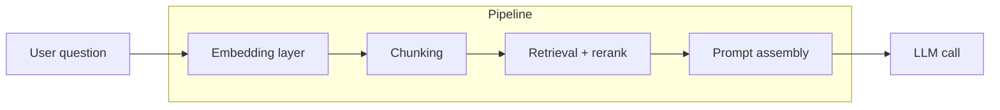

# RAG architecture

AMX retrieves grounding evidence through three independent pipelines —
**Document RAG**, **Code RAG**, and **Catalog Search** — that share a
common four-layer shape: embed, chunk, retrieve, assemble.

Each pipeline answers a different question:

| Pipeline | Backing collection | What it answers |
| --- | --- | --- |
| **Document RAG** | `amx_docs` | "What do my ingested docs say about this column / report / concept?" |
| **Code RAG** | `amx_code` | "Where in the codebase is this column written, read, or transformed?" |
| **Catalog Search** | `amx_search_<profile>` | "Which tables / columns match this question?" — backs `/ask` and `/search`. |

The pipelines never see each other's chunks. They run in parallel and
their results meet at the orchestrator (see
[Architecture](architecture.md)).

## The four layers

### 1. Embedding layer

Pluggable per pipeline via [`/embeddings`](../cli/setup.md). The
default is **MiniLM-L6-v2** (384-dim, English, offline, bundled by
Chroma) — small, deterministic, and zero-config. Three provider kinds
are supported:

| Kind | When to use |
| --- | --- |
| `minilm` | Default; offline, fast, good baseline English retrieval. |
| `openai_compatible` | Any OpenAI-style `/embeddings` endpoint (OpenAI, Azure, vLLM, llama.cpp). Best quality for general English prose. |
| `sentence_transformers` | Local HuggingFace model. Useful for code-specialised or multilingual embedders. |

Each Document RAG / Code RAG collection records its
`embedding_provider` and `embedding_model` in Chroma metadata on
creation. Reopening a collection with a different provider raises
`EmbeddingProviderMismatch` — the recovery is `/docs reindex` or
`/code-refresh`, never silent re-embedding. Catalog Search's
`/search rebuild` is the equivalent recovery for tables/columns.

### 2. Chunking

Document RAG uses LangChain's `RecursiveCharacterTextSplitter` with
the structural separator hierarchy `["\n\n", "\n", ". ", " ", ""]` —
paragraph-aware first, then line, sentence, word, character. Default
window: 1000 characters with 200-character overlap.

Code RAG is **AST-aware** for Python: one chunk per function or class,
with `start_line` and `end_line` preserved so citations point at the
exact lines. Jupyter notebooks chunk one cell at a time. Other source
languages fall back to a 4000-character recursive splitter.

Catalog Search does not chunk in the document sense — each catalog
entity (a table or column) is its own "chunk" with structured
metadata.

### 3. Retrieval + rerank

| Pipeline | Vector | Lexical | Rerank |
| --- | --- | --- | --- |
| Document RAG | Chroma cosine, top-k over-fetched to `max(k, min(4k, 40))` | — | Heuristic: `distance + token_overlap + explanatory_terms − header_penalty` |
| Code RAG | Chroma cosine, top-k over-fetched | Identifier-token overlap | Hybrid: `distance + 2.5 × keyword_overlap` |
| Catalog Search | Chroma cosine per profile | SQLite FTS5 (BM25) | Hybrid additive + source-kind weighting (manual ≫ reviewed ≫ generated) + confidence bonus |

The Catalog Search path also runs a two-pass LLM **query planning**
step that classifies the question (`question_class`), surfaces entity
hints, and may translate a non-English question into English search
queries before retrieval.

### 4. Prompt assembly

The RAG Agent assembles the retrieved chunks into the user message
sent to the LLM. The chunks arrive in descending relevance and are
truncated to `rag_max_chunks` (configurable per
[prompt-detail preset](../cli/run-and-apply.md): 5 / 8 / 12 / 15).
Per-chunk extractive compaction keeps the first ~1200 characters and
the last ~300 characters of each chunk so very long documents don't
crowd out other evidence.

## Defaults at a glance

| Knob | Default | Where to change |
| --- | --- | --- |
| Embedder | `minilm-l6-v2` | `/embeddings` |
| Docs chunk size / overlap | 1000 chars / 200 chars | hardcoded today; configurable in the chunking roadmap |
| Code chunk strategy | AST for Python, 4000-char for other code | hardcoded |
| Top-k retrieved | 5 | `/docs search --results N` for ad-hoc; preset-driven for `/run` |
| Chunks fed to LLM | 8 (default preset) | prompt-detail preset |

## Tuning recommendations

- **English prose corpora**: default MiniLM is fine. For higher
  quality without leaving offline, switch to `bge-small-en-v1.5` via
  `/embeddings sentence_transformers BAAI/bge-small-en-v1.5`.
- **Code-heavy corpora**: switching the Code RAG embedder to a
  code-specialised model improves identifier-heavy retrieval; see
  the rollout below.
- **Long-form questions**: bump `rag_max_chunks` via the
  `detailed` / `full` prompt preset.

## Roadmap

The architecture above is the current state. The following retrieval
improvements are tracked and will land in sequence:

1. **Format-dispatching chunker** for Document RAG — Markdown-header-
   aware, code-aware, CSV row-group, token-counted budgets, with the
   existing AST chunker reused for `.py` files when they enter via
   `/docs ingest`.
2. **FTS5 hybrid retrieval** for Document RAG, mirroring the catalog
   pattern (BM25 sidecar + RRF fusion of dense and lexical results).
3. **Cross-encoder rerank** (opt-in) — replaces the heuristic with a
   model-based reranker for the top-K candidate pool.
4. **Query rewriting** for Document RAG, reusing the catalog planner.
5. **Edges-first context assembly** — places the highest-relevance
   chunks at both ends of the prompt to recover the "lost in the
   middle" attention gap.
6. **Per-model context budget** — replaces the heuristic 3× output
   budget with a real per-provider input window lookup.

Each step ships with a measurable retrieval delta against the
[retrieval evaluation harness](../evaluation/retrieval-eval.md).
