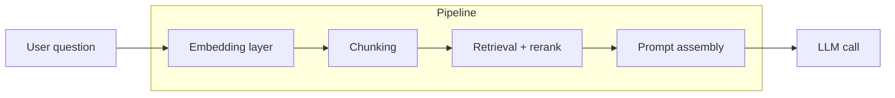

# RAG architecture

AMX retrieves grounding evidence through three independent pipelines —
**Document RAG**, **Code RAG**, and **Catalog Search** — that share a
common four-layer shape: embed, chunk, retrieve, assemble.

Each pipeline answers a different question:

| Pipeline | Backing collection | What it answers |
| --- | --- | --- |
| **Document RAG** | `amx_docs` | "What do my ingested docs say about this column / report / concept?" |
| **Code RAG** | `amx_code` | "Where in the codebase is this column written, read, or transformed?" |
| **Catalog Search** | `amx_search_<profile>` | "Which tables / columns match this question?" — backs `/ask` and `/search`. |

The pipelines never see each other's chunks. They run in parallel and
their results meet at the orchestrator (see
[Architecture](architecture.md)).

## The four layers



### 1. Embedding layer

Pluggable per pipeline via [`/embeddings`](../cli/setup.md). Three
provider kinds are supported:

| Kind | When to use |
| --- | --- |
| `minilm` | Document RAG default; offline, fast, 384-dim, good baseline English retrieval. |
| `openai_compatible` | Any OpenAI-style `/embeddings` endpoint (OpenAI, Azure, vLLM, llama.cpp). Best quality for general English prose. |
| `sentence_transformers` | Local HuggingFace model. Used by the **code-specialised default** below and for any other custom embedder. |

**Defaults per pipeline:**

- **Document RAG** — MiniLM-L6-v2 (384-dim), bundled, zero-config.
- **Code RAG** — `jinaai/jina-embeddings-v2-base-code` (768-dim, ~161 MB,
  code-trained) when `sentence-transformers` is installed; falls back
  to MiniLM when it isn't. Identifier-heavy, snake_case, and CamelCase
  queries are measurably better on the code-trained encoder. Install
  the extra to opt in:
  ```bash
  pip install "amx-cli[local-embeddings]"
  ```
  Users without the extra get MiniLM plus a one-time WARNING in the
  log on first `/code search` naming the install command.
- **Catalog Search** — same as Document RAG.

Each collection records its `embedding_provider`, `embedding_model`,
and `embedding_dim` in Chroma metadata on creation. Reopening with a
different identity raises `EmbeddingProviderMismatch` (Document RAG),
`CodeEmbeddingMismatch` (Code RAG), or `CollectionIdentityMismatch`
(Catalog Search) — never silent re-embedding. Recovery commands per
pipeline: `/docs reindex`, `/code-refresh`, `/search rebuild`.

### 2. Chunking

Document RAG dispatches by file extension via
`amx.docs.splitters.get_splitter`:

| Extension | Splitter | Notes |
| --- | --- | --- |
| `.md` / `.markdown` | Markdown-header-aware (two-stage) | Splits by `#`/`##`/`###` headers; records heading path on each chunk's `h1`/`h2`/`h3` metadata. Long sections are further chunked to fit the budget; header metadata propagates onto every sub-chunk. The heading line stays in the chunk body so the LLM sees the structure too. |
| `.txt`, `.pdf`, `.csv`, `.docx`, `.html`, `.py`, ... | `RecursiveCharacterTextSplitter` | Default. Structural separator hierarchy `["\n\n", "\n", ". ", " ", ""]` — paragraph → line → sentence → word → character. 1000 chars per chunk, 200-char overlap. |
| Unknown extension | Default (fallback) | Never raises `KeyError`. |

The header metadata is the channel future prompt-assembly upgrades
use for citation strings ("`orders.md → h2: total_amount`"). Chunks
from non-Markdown extensions never have `h1`/`h2`/`h3` keys —
downstream code that reads them treats absence as "no structural
hint available."

Code RAG is **AST-aware** for Python: one chunk per function or
class, with `start_line` and `end_line` preserved so citations point
at the exact lines. Jupyter notebooks chunk one cell at a time.
Other source languages fall back to a 4000-character recursive
splitter.

Catalog Search does not chunk in the document sense — each catalog
entity (a table or column) is its own "chunk" with structured
metadata.

### 3. Retrieval + rerank

| Pipeline | Vector | Lexical | Fusion | Rerank | Diversity |
| --- | --- | --- | --- | --- | --- |
| Document RAG | Chroma cosine, top-k over-fetched to `max(k, min(4k, 40))` | SQLite FTS5 (BM25), Porter unicode61 tokeniser, same top-k pool | Reciprocal Rank Fusion (k=60) over the two channels | Heuristic (default): `distance + token_overlap + explanatory_terms − header_penalty`. Opt-in: cross-encoder (`cross-encoder/ms-marco-MiniLM-L-6-v2` ~80 MB, English) or `BAAI/bge-reranker-v2-m3` (~568 MB, multilingual) when `cfg.docs.rerank.kind` is set. | MMR (λ=0.7) over the reranked pool, demotes near-duplicate chunks |
| Code RAG | Chroma cosine, top-k over-fetched | Identifier-token overlap | Additive weighted | `distance + 2.5 × keyword_overlap` | — |
| Catalog Search | Chroma cosine per profile | SQLite FTS5 (BM25) | Additive weighted | Hybrid + source-kind weighting (manual ≫ reviewed ≫ generated) + confidence bonus | — |

The opt-in cross-encoder rerank requires
`pip install "amx-cli[local-embeddings]"`. It replaces the
heuristic when active; on any failure (extra not installed, model
download blocked, prediction error) it logs a structured warning
and returns the heuristic's ordering unchanged. The cross-encoder
is a quality *upgrade*, never a single point of failure.

For Document RAG specifically: every Chroma upsert mirrors the same
chunk into a SQLite FTS5 sidecar at
`<persist_dir>/docs_fts.sqlite`. Returning users get hybrid
retrieval on next `RAGStore` open via a one-time backfill that
seeds the FTS table from existing Chroma chunks; no manual reindex
required. Queries that produce no alphanumeric tokens (or hit a
sidecar error) fall back to vector-only — backward-compatible.

The Catalog Search path also runs a two-pass LLM **query planning**
step that classifies the question (`question_class`), surfaces entity
hints, and may translate a non-English question into English search
queries before retrieval.

### 4. Prompt assembly

The RAG Agent assembles the retrieved chunks into the user message
sent to the LLM through three steps:

1. **Truncate + edges-first reorder.** Chunks arrive in descending
   relevance from rerank. `assemble_chunks(chunks, k)` takes the
   top-k and reorders them so the highest-relevance chunks anchor
   *both* ends of the prompt — `[c1, c3, c5, c6, c4, c2]` for
   `k=6` — pushing mid-scorers into the attention-dead middle.
   This combats the "Lost in the Middle" failure documented in
   Liu et al. (2023). `k` is `rag_max_chunks` (configurable per
   [prompt-detail preset](../cli/run-and-apply.md): 5 / 8 / 12 / 15).

2. **Citation header per chunk.** Every chunk body gets a
   one-line prefix:
   ```
   [orders.md | section=total_amount] (rel=1.34)
   <chunk body>
   ```
   The header reads `source.basename` + `h2`/`h3`/`h1` from chunk
   metadata (produced by the Markdown-aware splitter) and the
   rerank score. Plain-text chunks degrade gracefully to
   `[plain.txt]`. The header gives the LLM a scannable summary
   even when attention is weakest mid-prompt and gives downstream
   citation extraction a stable channel to mine.

3. **Per-model input budget.** The input window is the smaller of
   `litellm.get_model_info(model)["max_input_tokens"] - output - 256`
   (real per-provider window) and the legacy `max(1000, max_tokens * 3)`
   heuristic (used as a fallback for unknown / proxy models). Stops
   AMX from over-stuffing a small-context Mistral or under-using a
   200k-token Claude.

Per-chunk extractive compaction (first ~1200 characters + last
~300 characters of each chunk) still runs after these steps when
the assembled context still exceeds the budget — that part is
unchanged.

## Defaults at a glance

| Knob | Default | Where to change |
| --- | --- | --- |
| Docs RAG embedder | `minilm-l6-v2` | `/embeddings` |
| Code RAG embedder | `jinaai/jina-embeddings-v2-base-code` if `amx-cli[local-embeddings]` is installed; else `minilm-l6-v2` (with one-time warning) | install the extra, or `/embeddings` |
| Catalog Search embedder | `minilm-l6-v2` | `/embeddings` |
| Docs chunk size / overlap | 1000 chars / 200 chars | hardcoded today; configurable in the chunking roadmap |
| Code chunk strategy | AST for Python, 4000-char for other code | hardcoded |
| Top-k retrieved | 5 | `/docs search --results N` for ad-hoc; preset-driven for `/run` |
| Chunks fed to LLM | 8 (default preset) | prompt-detail preset |

## Tuning recommendations

- **English prose corpora**: default MiniLM is fine. For higher
  quality without leaving offline, switch to `bge-small-en-v1.5` via
  `/embeddings sentence_transformers BAAI/bge-small-en-v1.5`.
- **Code-heavy corpora**: install `amx-cli[local-embeddings]` to
  pick up the code-specialised default. Already opted in if you
  installed the extra — Code RAG uses it automatically with no
  config change.
- **Long-form questions**: bump `rag_max_chunks` via the
  `detailed` / `full` prompt preset.

## Roadmap

The architecture above is the current state. The following retrieval
improvements are tracked and will land in sequence:

1. **Format-dispatching chunker — follow-ups.** F1.1 (Markdown
   header awareness) shipped; F1.2 (token-counted budgets), F1.3
   (`cfg.docs.chunking` knobs), F1.4 (chunker signature in
   collection metadata), and the `.py` / `.csv` / `.pdf`
   specialisations are open as follow-up PRs on the dispatcher seam.
3. **Cross-encoder rerank** (opt-in) — replaces the heuristic with a
   model-based reranker for the top-K candidate pool.
4. **Query rewriting** for Document RAG, reusing the catalog planner.
5. **Edges-first context assembly** — places the highest-relevance
   chunks at both ends of the prompt to recover the "lost in the
   middle" attention gap.
6. **Per-model context budget** — replaces the heuristic 3× output
   budget with a real per-provider input window lookup.

Each step ships with a measurable retrieval delta against the
[retrieval evaluation harness](../evaluation/retrieval-eval.md).
