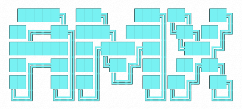
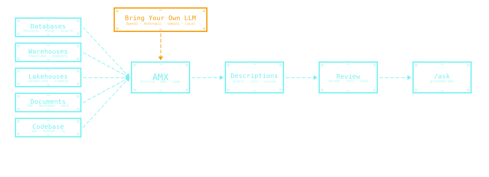
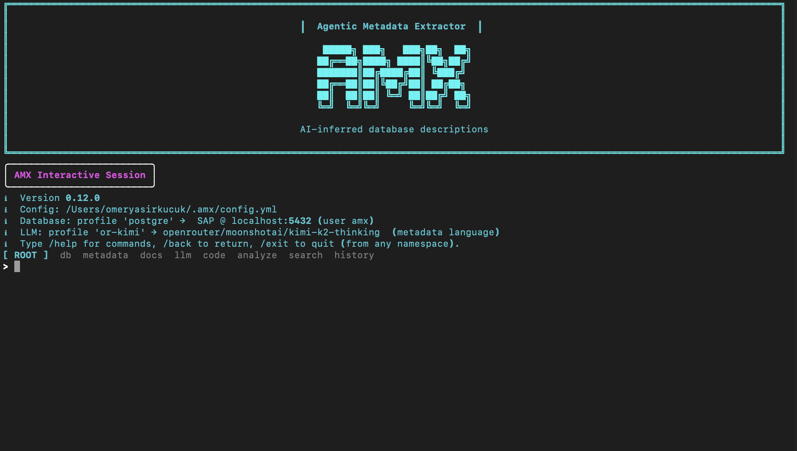

<h1 class="amx-visually-hidden">AMX — Agentic Metadata Extractor</h1>

<section class="amx-landing__hero">

AGENTIC METADATA EXTRACTOR

AI-powered CLI that documents undocumented database schemas. Reads your database, docs, and code; drafts column descriptions with confidence scores; lets a human review before anything lands.

<svg viewBox="0 0 24 24" width="14" height="14" fill="currentColor" aria-hidden="true"><path d="M12 1l9 4v6c0 5.55-3.84 10.74-9 12-5.16-1.26-9-6.45-9-12V5l9-4zm0 2.18L5 6.3v4.7c0 4.52 2.98 8.69 7 9.93 4.02-1.24 7-5.41 7-9.93V6.3l-7-3.12z"/></svg>
Runs entirely on your machine or in your cloud. <strong>Self-hosted, on-prem, air-gapped</strong> — bring your own LLM, nothing leaves your perimeter.

<a class="amx-landing__btn amx-landing__btn--primary" href="getting-started/">Get Started →</a>
<a class="amx-landing__btn amx-landing__btn--ghost" href="https://github.com/omeryasirkucuk/amx" target="_blank" rel="noopener">View on GitHub</a>

<code class="amx-landing__install" title="Click to copy">pip install amx-cli</code>

 10 database backends
 8 LLM providers
 Apache-2.0

<a href="#three-agents" class="amx-landing__scroll-down" aria-label="Scroll to features">
<svg viewBox="0 0 24 24" width="22" height="22" fill="currentColor" aria-hidden="true"><path d="M16.59 8.59L12 13.17 7.41 8.59 6 10l6 6 6-6z"/></svg>
</a>
</section>

<section class="amx-landing__section" id="three-agents">
<h2 class="amx-landing__h2">Three agents. One review.</h2>

Most metadata tools work column-by-column on the schema alone. AMX runs three specialist agents in parallel — across your database, your documentation, and your codebase — and merges the evidence before a human ever sees a draft.

<h3>Multi-source evidence</h3>

The Profile agent walks the schema. The RAG agent reads your documentation. The Code agent traces SQL/Python references. Drafts cite the rows the LLM read, so you never get a fabricated column name back.

<h3>Self-hosted, BYO-LLM</h3>

Runs entirely in your environment. OpenAI, Anthropic, Gemini, Databricks Serving, Ollama, vLLM, LM Studio — your choice. Schema names, sample values, generated descriptions and the audit trail all stay where you started.

<h3>Human-in-the-loop</h3>

Confidence-scored drafts in batches. Review wizard with bulk-accept, then native <code>COMMENT ON</code> write-back to the warehouse you already speak. Whole-warehouse first-pass in minutes, not weeks.

</section>

<section class="amx-landing__section amx-landing__demo">
<h2 class="amx-landing__h2">Two surfaces. One workflow.</h2>

Drive AMX from the terminal with slash commands — <code>/setup</code>, <code>/run</code>, <code>/apply</code>, <code>/ask</code> — or open the local Studio for a clickable review. Same runs, same review queue, same audit trail.

CLI Interactive session — slash command palette, dynamic config, and the review wizard.

Studio Local web UI — overview dashboard, recent runs, and the pending review queue.

</section>

<section class="amx-landing__section amx-landing__why-section">
<h2 class="amx-landing__h2">Why AMX</h2>

<strong>The pain</strong>
Most AI metadata tools work <strong>column-by-column, schema-only</strong> — you approve generic suggestions one at a time, with no project context. Combining database + documentation + codebase evidence with a structured human review is rare; doing all four with native <code>COMMENT ON</code> write-back is rarer still.

<strong>The angle</strong>
Database <strong>+</strong> documentation <strong>+</strong> codebase <strong>+</strong> human review, run together. Drafts in batches with confidence scores, written back as the SQL your warehouse already speaks. Whole-warehouse first-pass in <strong>minutes</strong>, not weeks.

<strong>Ask it</strong>
Open a session with <code>/ask</code> and chat with the catalog you just built: <em>what joins to <code>customer</code>?</em>, <em>any columns missing descriptions?</em>, <em>what does <code>x_legacy_status</code> mean?</em>, <em>which tables haven't been touched in 90 days?</em>. Plain English in, grounded answers out — every response cites the exact catalog rows the LLM read, so you never get a fabricated column name back.

<strong>Self-hosted</strong>
AMX runs entirely in your environment. <strong>No SaaS account, no data leaves your network</strong>, bring-your-own-LLM — including local models (Ollama, vLLM, LM Studio). The compliance question collapses to <em>nothing leaves your perimeter</em>: schema names, sample values, generated descriptions, the audit trail — all stay where you started. Released under the <strong><a href="https://github.com/omeryasirkucuk/amx/blob/main/LICENSE">Apache License 2.0</a></strong> — free for any use, including commercial.

</section>

<section class="amx-landing__section amx-landing__cta">

<h2 class="amx-landing__h2">Five minutes to your first reviewed description.</h2>

Install from PyPI, run <code>amx</code>, walk through the <code>/setup</code> wizard. The fastest way to evaluate.

<code class="amx-landing__install amx-landing__install--lg">pip install amx-cli</code>

<a class="amx-landing__btn amx-landing__btn--primary" href="getting-started/quickstart/">5-minute Quickstart →</a>
<a class="amx-landing__btn amx-landing__btn--ghost" href="getting-started/">Read the docs</a>

</section>

