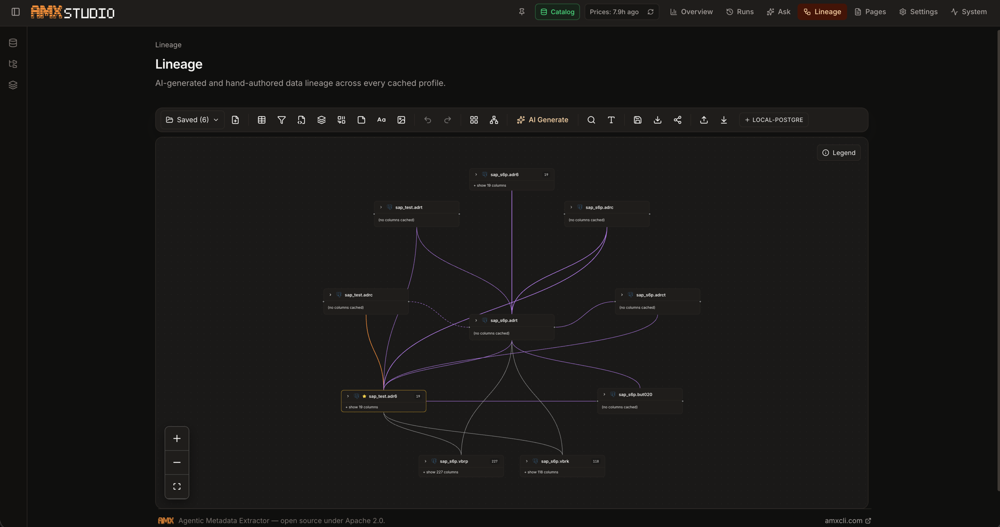

# Lineage

The Lineage canvas (`/lineage`) is where you draw, generate, and
review how data moves between tables. One canvas can host nodes
from any number of DB profiles — drop a Postgres table next to a
Snowflake table next to a Power BI logo and wire them together.

## What you can put on the canvas

| Node type | Purpose |
|---|---|
| **Table** (`+ Add table`, `D`) | A real table from any cached DB profile. Renders schema + table name, a column count badge, and one row per column. Each column row has its own left / right handle so edges can attach at column granularity. Long tables auto-collapse at 25+ columns and surface a built-in column-name filter when expanded. |
| **Filter operator** (`F`) | WHERE-clause node with an `@`-mention expression editor. Type `@` to autocomplete from the upstream node's columns. |
| **Join** (`J`), **Group by** (`G`), **Function** (`E`) | Generic operator nodes for the rest of the SQL surface; each has its own colored border tag and inline editable expression. |
| **Comment / sticky note** (`C`) | Colored sticky note for free-form review notes. Six palette colors, resizable. |
| **Text label** (`T`) | Plain rich-text annotation — font size, bold, color, bullet list. Auto-grows with paragraphs. Use it for canvas section headings ("Production pipeline", "Staging"). |
| **Logo node** (`I`) | Standalone external-system node. Pick from 22 default brand logos (AWS, GCP, Azure, Snowflake, Databricks, BigQuery, Postgres, MySQL, Redshift, Power BI, Tableau, Looker, Metabase, Apache Superset, dbt, Apache Airflow, Fivetran, Apache Kafka, Apache Spark, Apache Iceberg, Microsoft SharePoint, Dfive) or upload your own (SVG / PNG / JPG / WebP, ≤ 200 KB) under any custom key. |

Every node carries an explicit floating trash button on selection
and a draggable grip; Backspace / Delete on a selected node also
works.

## Multi-select + delete

- **⌘ / Ctrl + click** adds a node to the current selection.
- **Shift + drag** on the canvas rubber-bands a rectangle.
- **Backspace** or **Delete** removes every selected node and its
  incident edges in one pass — works for tables, operators,
  comments, text labels, and logo nodes alike.

## Drawing edges

Drag from a column-row handle on one node to a column-row handle
on another. The edge renders as a Bezier curve, colored by
relationship type (FK black, view-DDL blue, query-log green,
LLM purple). Hover the edge to see the type + confidence label.

Right-click an edge for `Approve`, `Reject`, or `Delete`. Verdicts
ride into the next AI Generate run as positive / negative few-shot
examples so the LLM converges on your taste.

## AI Generate

Click **AI Generate** in the toolbar, pick an anchor table, and
the canvas streams suggestions in batches as the pipeline runs:

1. **Foreign keys** — deterministic, instant.
2. **View DDL** — parsed `CREATE VIEW` definitions from the
   cached `view_definitions_cache`.
3. **Deterministic** — query-log co-occurrence + codebase scan +
   manually authored edges.
4. **LLM suggest** — an on-demand LLM call that grounds itself in
   the anchor's full context: table + column descriptions, FK
   partners, views that join the anchor, query-log co-occurrence,
   and previously approved / rejected edges for the profile.

The candidate list the LLM sees is ranked by a weighted-sum
score over six signals (FK partnership, view co-mentions,
query co-occurrence, shared column names, name prefix, matching
column-name tokens) so on SAP-style schemas the prompt never
fills up with sibling tables that just happen to share a prefix.

Suggestions stream in with a dashed purple stroke and a
confidence badge; right-click each edge to approve or reject.
Saved verdicts feed back into the next run's prompt at full
column-pair granularity ("user approved `customers.id →
orders.customer_id`", not just "`customers → orders`").

### Streaming UX

- Anchor picker remembers the active profile's database label
  even when it differs from the catalog row's synced label —
  picking `sap_s6p.adr6` works whether you're scoped to the
  picker's `bird_train` or the row's `SAP`.
- Streamed edges land on the existing canvas node when an FQN
  match exists, so you never get a duplicate of your anchor.
- Self-loops (`anchor → anchor`) are rejected server-side and
  filtered client-side as defence-in-depth.
- Catalog-unknown endpoints (e.g. SQL fragments the codebase
  scanner can't resolve to a real table) are filtered before they
  reach the canvas.

## Native Databricks lineage

The canvas can pull **real** lineage out of Databricks instead of
inferring it. On a Unity Catalog-connected profile, the
**Native lineage** picker hits Databricks' lineage REST endpoints
(not `system.access.*`) and renders every neighbour the caller has
permission to see. The picker supports full-tree search across
catalog → schema → table → column so you can land on a specific
asset without scrolling.

### Privilege-tiered ghost nodes

Databricks returns lineage edges even when the caller only has
directory-level visibility on the neighbour. AMX renders those
neighbours as **name-only ghost nodes**: the canvas shows the
qualified name, but no column count and no column-row handles —
because AMX has not seen the columns. Ghost nodes carry a faint
dashed border so it's obvious you are looking at a privilege-
gated edge, not a fully-cached table. Click a ghost to ingest the
asset (next section); after ingest, the ghost becomes a normal
table node with column rows.

### Click-to-ingest

Click any native artifact node — notebook, query, job, pipeline,
or table — and AMX lazy-ingests just that asset on demand:

- **Notebooks** resolve through a **persisted workspace path index**.
  AMX maintains an `object_id → (name, path)` map in the
  background and reads from it on click; there is no 40-second
  workspace scan and no broken `get-status object_id` round-trip.
  Single-notebook ingest hits the workspace path directly.
- **Queries, jobs, pipelines** ingest by Databricks id — one round
  trip, one row inserted into the matching `remote_*` table.

The ingest endpoint (`POST /api/lineage/asset/ingest`) requires the
**writer** role on the shared store, so view-only members cannot
mutate the shared catalog through a curiosity click.

### Where assets open

After ingest, clicking a node **opens the asset inside AMX** by
default — the notebook source view, the query playbook, or the
pipeline detail page, depending on the kind. The previous
behaviour of deep-linking to the Databricks UI on every click is
gone (it was noisy and broke whenever the workspace host changed).
A separate "open in Databricks" link is available on each asset's
detail panel for power users who want to jump back to the
Databricks workspace.

Tables on the canvas still expose their backend logo, so the
provenance of every node is visible at a glance even when the
column-row handles are collapsed.

## Saving + re-opening

**Save canvas** persists every node, edge, comment, text label,
and logo as a single artifact under its display name. Re-open
via the **Open saved** tile on the lineage hub or the
`/lineage?artifact=<id>` deep link. The artifact name is purely
a label — it never participates in node resolution, so naming a
canvas "orders" no longer collides with a real `orders` table.

## Export + share

The toolbar exposes:

- **PNG export** — flatten the canvas via `html-to-image`.
- **Share** — copy a `/lineage?artifact=<id>` deep link to the
  clipboard.
- **SQL import / export** — paste a SELECT statement into the
  importer to spawn nodes for the parsed tables + operator chain;
  Export renders the current canvas back into a SELECT via
  `sqlglot`. Round-trip preserves the table + operator + filter
  structure.

## Keyboard shortcuts

| Key | Action |
|---|---|
| `D` | Add table |
| `F` | Add filter |
| `E` | Add function |
| `G` | Add group-by |
| `J` | Add join |
| `C` | Add comment (sticky) |
| `T` | Add text label |
| `I` | Add logo |
| `L` | Auto-arrange |
| `⌘K` | Search the canvas |
| `⌘⇧F` | Track an attribute by name |
| `⌘S` | Save canvas |
| `Backspace` / `Delete` | Delete selected node(s) |

Single-letter shortcuts only fire when the canvas (not an input
or editor) holds focus, so typing in a Filter expression or a
text label never spawns a modal.
